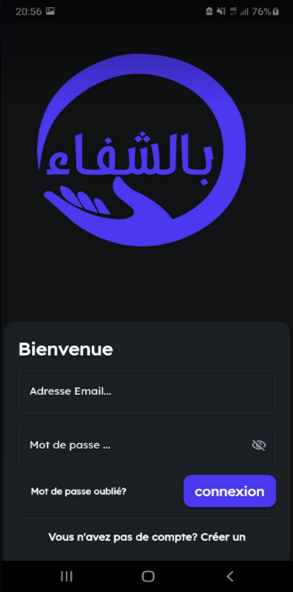
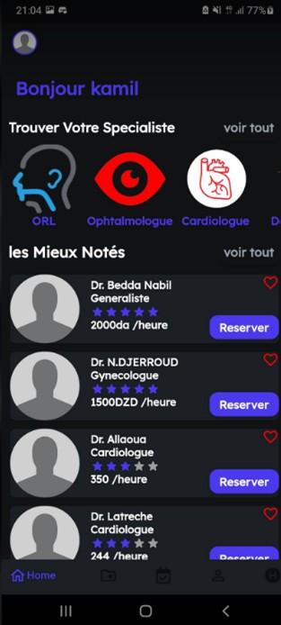

# Bechfa - Private Doctor Booking & Emergency Locator App
A new Flutter project.

## Description


Bechfa is a mobile application designed to simplify the process of booking appointments with private doctors in Algeria. Users can easily reserve a doctor without the need to visit clinics, track the doctor's location, and find the nearest hospital in case of emergencies. The app integrates Google Maps API and Firebase for real-time location tracking and booking management, providing a seamless experience for users seeking healthcare services.
Features include:
- Book private doctors online.
- Track doctor locations.
- Find nearest hospitals during emergencies.
- Built using Google Maps API and Firebase for real-time data.
- Let me know if you'd like any adjustments!
- 
 
 

---

## Prerequisites
Before you run the project, make sure you have the following installed:
- **Flutter SDK: Version 2.0 or above**
- **Dart SDK: Version 2.12 or above**
- Android Studio (or preferred IDE) with Flutter plugin
- Firebase Account: For authentication and database services
- Google Maps API Key: For map and location services
- Node.js & npm: For Firebase CLI (optional for deployment)

---
## Getting Started

FlutterFlow projects are built to run on the Flutter _stable_ release.

### IMPORTANT:

For projects with Firestore integration, you must first run the following commands to ensure the project compiles:

```
flutter pub get
flutter packages pub run build_runner build --delete-conflicting-outputs
```

This command creates the generated files that parse each Record from Firestore into a schema object.

In your **pubspec.yaml** file, add the following dependencies:
```
dependencies:
firebase_core: latest_version
firebase_auth: latest_version
cloud_firestore: latest_version
```
### Getting started continued:

A few resources to get you started if this is your first Flutter project:

- [Lab: Write your first Flutter app](https://flutter.dev/docs/get-started/codelab)
- [Cookbook: Useful Flutter samples](https://flutter.dev/docs/cookbook)

For help getting started with Flutter, view our
[online documentation](https://flutter.dev/docs), which offers tutorials,
samples, guidance on mobile development, and a full API reference.

---

## License
 - This project is open-source and free to use under the MIT license.
---
